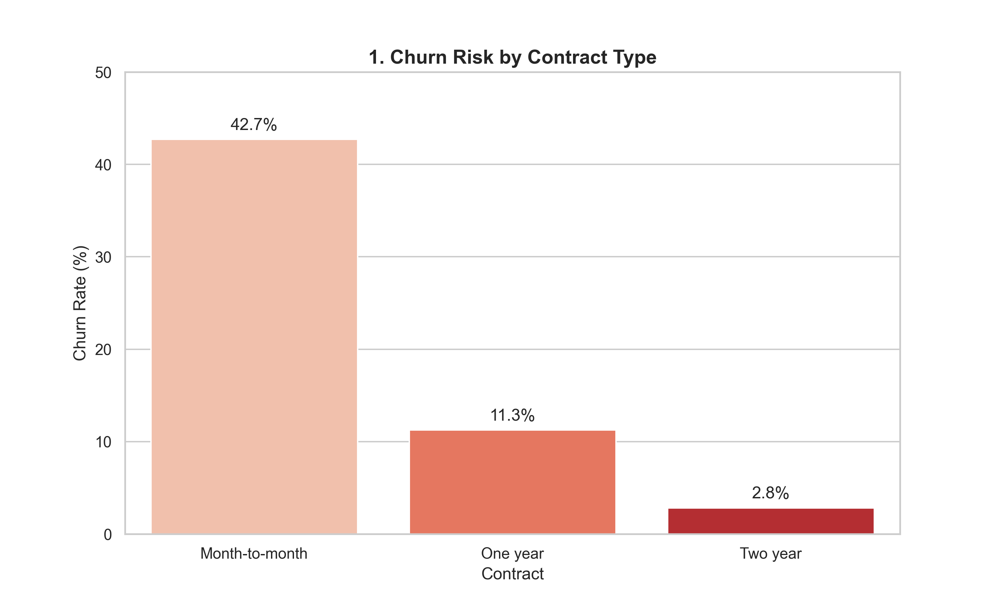
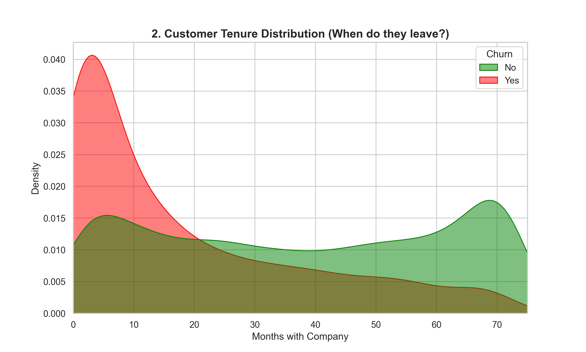
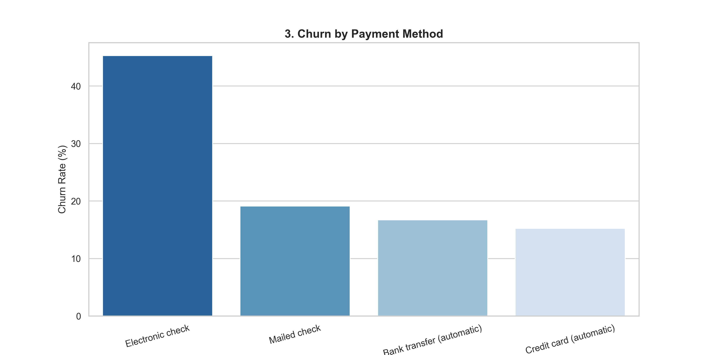

# 📡 Telco Customer Churn Prediction

 

## 📊 Project Overview
In the competitive telecom sector, retaining customers is critical. This project analyzes **7,043 real customer records** to predict churn risks.
* **Goal:** Identify factors that drive customer attrition and recommend retention strategies.
* **Data Source:** [Telco Customer Churn Dataset (Kaggle)](https://www.kaggle.com/datasets/blastchar/telco-customer-churn) - *Data included in `data/` folder.*

## 🔍 Key Business Insights
1.  **Contract Trap:** Customers on **Month-to-Month contracts** are **15x more likely to churn** than those on 2-year contracts.
2.  **The "First Year" Danger Zone:** The majority of churn happens within the first 12 months (see Chart 2). If a customer stays past year 1, they are likely to remain loyal.
3.  **Payment Friction:** "Electronic Check" users have the highest churn, indicating potential UX issues with that payment gateway.

## 📉 Visual Analysis

### 1. Contract Type Risk
*Month-to-month contracts are the single biggest predictor of churn.*

### 2. Tenure Distribution (When do they leave?)
*Red area shows churned customers leaving early (0-12 months). Green area shows loyal customers.*

### 3. Payment Method Impact
*Electronic check users churn at a significantly higher rate than automatic payment users.*

## 🛠 Technical Implementation
* **Language:** Python 3.10
* **Libraries:** `Pandas` (Data Manipulation), `Seaborn` (Advanced Visualization).
* **File Structure:**
    * `data/`: Raw CSV dataset.
    * `images/`: Generated charts for reporting.
    * `churn_analysis.py`: Main script to run the analysis.

## 🚀 How to Run
1. Clone the repository.
2. Install dependencies: `pip install pandas matplotlib seaborn`
3. Run the script: `python churn_analysis.py`
